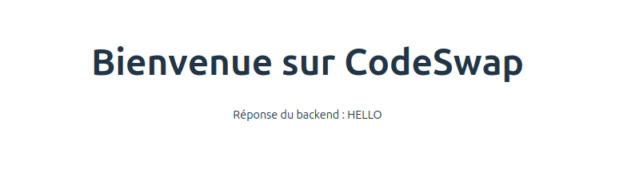

# Documentation : Communication entre Backend, Logic et Frontend

## 1. Vue d’ensemble

Le projet suit une _architecture en trois couches distinctes_, chacune ayant un rôle précis :

- **Backend (Spring Boot)** : API REST qui gère les requêtes du Frontend et appelle Logic pour le traitement des données.

- **Logic (Node.js)** : Service indépendant qui effectue des transformations de données demandées par le Backend.

- **Frontend (Vue.js)** : Affiche l’interface utilisateur et envoie des requêtes HTTP au Backend.

Chaque couche communique via des requêtes HTTP et fonctionne indépendamment, garantissant une séparation des responsabilités claire (SoC).

---

## 2. Fonctionnement détaillé

### 1. L'utilisateur interagit avec **Frontend**

- L’utilisateur accède à `http://localhost:3000/` (port 3000).
- Le **Frontend** affiche une page et envoie une requête `fetch()` au **Backend** (`http://localhost:8080/api/test`).

### 2. **Frontend → Backend**

- Le **Frontend** envoie une requête HTTP `GET /api/test` au **Backend** (`Spring Boot`).
- Le **Backend** reçoit cette requête et doit traiter une donnée via `Logic`.

### 3. **Backend → Logic**

- **Le Backend ne traite pas lui-même la donnée.**
- Il envoie une requête HTTP `POST http://logic:5000/compute` au **service Logic** en lui passant une donnée.
- Le **service Logic** reçoit la requête et **convertit la donnée en majuscule** (exemple).

### 4. **Logic répond au Backend**

- Logic répond avec une réponse JSON :
  ```json
  { "result": "HELLO" }
  ```
- **Le Backend récupère cette réponse et la renvoie au Frontend.**

### 5. **Backend → Frontend**

- Backend retourne `"HELLO"` à Frontend, qui l'affiche à l’écran.

---

## 3. Schéma du cheminement

Représentation simplifiée du fonctionnement :

```
Utilisateur ⇄ Frontend (Vue.js) ⇄ Backend (Spring Boot) ⇄ Logic (Node.js)
```

1. **L’utilisateur accède à frontend** (`http://localhost:3000/`).
2. **Frontend envoie une requête** à Backend (`http://localhost:8080/api/test`).
3. **Backend appelle Logic** (`http://logic:5000/compute`).
4. **Logic traite et renvoie la donnée** (`{ "result": "HELLO" }`).
5. **Backend retourne "HELLO" à Frontend**, qui l’affiche sur la page.

---

## 4. Exemple de requêtes

### Requête envoyée par **Frontend** au **Backend**

```javascript
fetch("http://localhost:8080/api/test")
  .then((response) => response.text())
  .then((data) => console.log(data)); // Affiche "HELLO"
```

### Requête envoyée par **Backend** à **Logic**

```java
RestTemplate restTemplate = new RestTemplate();
String url = "http://logic:5000/compute";
Map<String, String> request = Map.of("data", "hello");

ResponseEntity<Map<String, Object>> response = restTemplate.postForEntity(url, request, (Class<Map<String, Object>>)(Class<?>)Map.class);
System.out.println(response.getBody().get("result")); // Affiche "HELLO"
```

### Réponse de **Logic**

```json
{ "result": "HELLO" }
```

---

## 5. Résumé

✔ **Frontend envoie une requête à Backend** (`http://localhost:8080/api/test`).  
✔ **Backend demande un traitement à Logic** (`http://logic:5000/compute`).  
✔ **Logic traite et renvoie la donnée (`"HELLO"`).**  
✔ **Backend retourne `"HELLO"` à Frontend, qui l'affiche.**

 _frontend_

 _backend_
